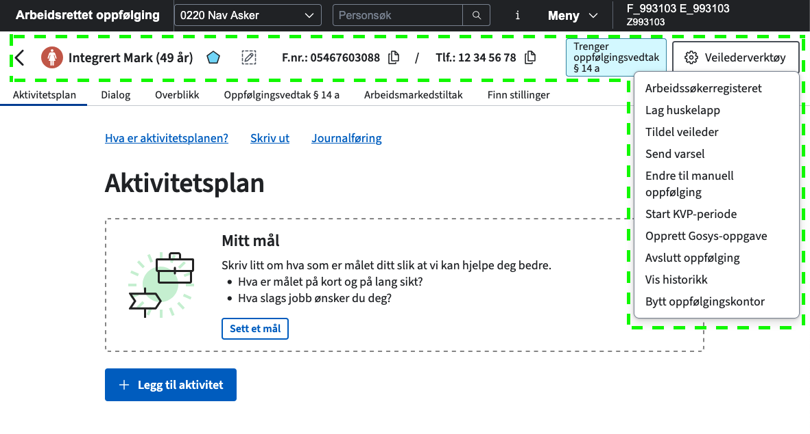

# Veilarbvisittkortfs

Personinfo om bruker og veilederverktøy

Demoløsning: https://navikt.github.io/veilarbvisittkortfs/



# Komme i gang

**Installere pakker**

For å kunne hente ned @navikt-pakker må du legge til en `.npmrc` fil i homemappen med følgende innhold:

```shell
//npm.pkg.github.com/:_authToken=TOKEN
@navikt:registry=https://npm.pkg.github.com
```

[Se navikt/frontend](https://github.com/navikt/frontend?tab=readme-ov-file#installere-pakker-lokalt) for å se hvordan du kan generere et token på github.

## Henvendelser

Spørsmål knyttet til koden eller prosjektet kan stilles ved å opprette en issue.

## For Nav-ansatte

Interne henvendelser kan sendes via Slack i kanalen #team-obo-poao

## Kode generert av GitHub Copilot

Dette repoet bruker GitHub Copilot til å generere kode.

## Rendre visittkortet som et custom element (web component)
```tsx
/* Definer props som visittkortet kan ta imot */
declare global {
    namespace JSX {
        interface IntrinsicElements {
            "ao-visittkort": React.DetailedHTMLProps<
                React.HTMLAttributes<HTMLElement> & {
                    fnr?: string
                    enhet?: string
                    tilbakeTilFlate?: string
                    visVeilederVerktoy?: string
                    skjulEtiketter?: string
                },
                HTMLElement
            >
        }
    }
}

export const Visittkort = () => {
    return <ao-visittkort
        enhet={"1234"}
        fnr={"123123123"}
        tilbakeTilFlate={"http://veilarbportefolje.nav.no"}
        visVeilederVerktoy={"true"}
        key={fnr}
    ></ao-visittkort>
}
```
